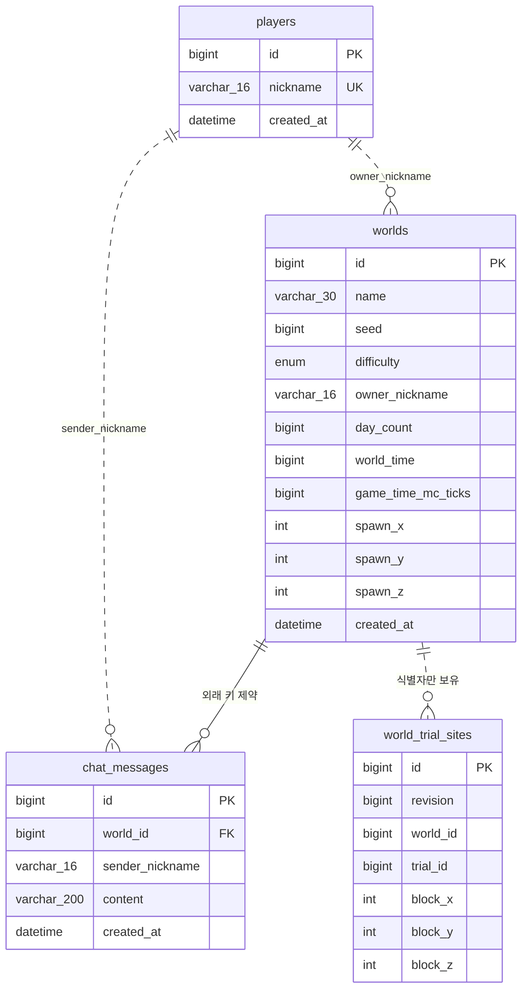

# **WebCraft 실시간 게임 서버 구현**

숙련 주차 프로젝트

## 필수 기능 구현 목록
- [X] Lv 1. Docker로 MySQL과 Redis 설정
- [X] Lv 2. SQL을 JPA 인덱스로 표현하기
- [X] Lv 3. 요청 검증과 DTO: 플레이어 등록
- [X] Lv 4. 월드 생성
- [X] Lv 5. 채팅 저장과 내역 조회
- [X] Lv 6. 최근 채팅 조회 API 구현
- [X] Lv 7. WebSocket 연결과 사용자 식별
- [X] Lv 8. HandshakeInterceptor 등록
- [X] Lv 9. 월드별 WebSocket 세션 관리
- [X] Lv 10. Redis 접속 상태 관리
- [X] Lv 11. 메시지 라우팅과 Ping/Pong
- [X] Lv 12. 플레이어 이동 요청 처리
- [X] Lv 13. 채팅 요청 처리와 응답 구성
- [X] Lv 14. 같은 월드의 참여자에게 채팅 전송
- [X] Lv 15. 접속자 목록 조회

## 도전 기능 구현 목록
- [X] Lv 16. 낙관적 락
  - 낙관적 락이란?
    - version과 같은 별도 값으로 수정되었다고 명시를 해 다른 세션이 동일 조건으로 값을 수정할 수 없도록 하는 방식
    - JPA에서는 @Version으로 사용 가능
- [X] Lv 17. 커서 페이지 조회
  - 커서란?
    - SQL 쿼리를 날려서 받아온 데이터 테이블에서 데이터를 한 줄씩 읽을 수 있도록 어느 줄을 읽고 있는지 위치를 짚어주는 포인터
- [X] Lv 18. Redis 최근 채팅 캐시
- [X] Lv 19. Redis Lua로 채팅 전송 횟수 제한
- [X] Lv 20. 멀티 서버
  - Docker Compose란?
    - 다수의 컨테이너가 함께 실행되는 환경에서 하나의 파일 내에 속성 등을 정의하여 다수의 컨테이너를 관리하기 위한 도구

## 실행 방법
사전 준비
   - docker 실행 확인
   - ```docker version```

### 실행
1. 실행 파일 생성
   - ```./gradlew bootJar```
2. 컨테이너 생성
   - ```docker compose up -d --build```
3. 실행 확인
   - ```docker compose ps```
코드를 수정 한 뒤에는 JAR 파일을 다시 만들고 이미지를 다시 빌드해야 반영이 된다.

### 종료
- ```docker compose stop```

## API 명세

### REST API
| 메서드 | 경로 | 성공 | 설명 |
| :--- | :--- | :--- | :--- |
| POST | /players | 201 | 플레이어 등록 |
| GET | /worlds | 200 | 월드 목록 조회 |
| POST | /worlds | 201 | 월드 생성 |
| GET | /worlds/{worldId}/chats | 200 | 최근 채팅 조회 |
| GET | /worlds/{worldId}/chats/history | 200 | 과거 채팅 커서 조회 |
| WS | /ws/worlds/{worldId} | 101 | WebSocket 연결 |

### ERROR
| error | 상태 | 설명 |
| :--- | :---: | :--- |
| VALIDATION_FAILED | 400 | 필수 값 누락, 길이·패턴 위반 또는 잘못된 숫자 파라미터 |
| INVALID_REQUEST_BODY | 400 | 잘못된 JSON, 알 수 없는 필드 또는 난이도 |
| WORLD_NOT_FOUND | 404 | 존재하지 않는 월드 |
| PLAYER_NOT_FOUND | 404 | 등록되지 않은 닉네임으로 월드 생성 |
| DUPLICATE_NICKNAME | 409 | 이미 등록된 닉네임 |
| WORLD_LIMIT_REACHED | 409 | 월드가 이미 3개인 상태에서 생성 |
| INTERNAL_ERROR | 500 | 예기치 못한 서버 오류 |
| WORLD_BASELINE_INITIALIZING | 503 | 서버 기동 직후 월드 준비가 끝나기 전 |

## ERD


## 실행 결과


## 문답
> Redis와 MySQL의 차이는 무엇인가요?
> > `대표적으로 Redis는 메모리에 데이터를 저장하고, MySQL은 디스크에 데이터를 저장합니다.
Redis는 메모리에 데이터를 저장하기 때문에 읽기/쓰기 속도가 빠르고, MySQL은 디스크에 데이터를 저장하기 때문에 안정적이게 보관할 수 있으며 복잡한 관계형 데이터 처리에 적합합니다.
또, Redis는 Key-Value 구조로 이루어져 있으며 Set/Hash 등과 같은 자료구조를 지원하고, MySQL은 행과 열로 이루어진 테이블이며 SQL로 데이터를 관리합니다.`

> 채팅 기능에 SSE보다는 WebSocket을 더 선호하는 이유는 무엇인가요?
> > `SSE는 단방향 통신으로 이루어져, 클라이언트가 서버로 메시지를 보내려면 HTTP 요청을 매번 보내야 하기 때문에 송신/수신이 자주 이루어지는 경우 비효율적입니다.
그에 비해 WebSocket은 양방향 통신을 지원하고, 양방향 전송 시 처음에 한번만 HTTP연결을 하고, 추가로 HTTP 요청을 하지 않기 때문에 지연시간이 낮아 WebSocket을 선호합니다.`

> Pub/Sub에서 Publisher와 Subscriber는 각각 어떤 역할을 하나요?
> > `간단하게 설명하면 Publisher는 메시지를 생성/발송하는 역할을 하고, Subscriber는 구독한 채널의 메시지를 수신 후 처리하는 역할을 합니다.
Publisher는 새로운 데이터나 메시지가 발생했을 때 채널에  그 메시지를 보냅니다. 이 때 그 메시지를 누가 받는지, 몇 명이 받는지는 알 필요가 없으며 채널에 메시지를 보내는 일만 수행합니다.
Subscriber는 특정 채널을 구독하고 있다가 그 채널에 새로운 메시지가 들어오게 된다면 이를 받아와 처리를 하게 됩니다. 이 때 그 메시지를 누가 보냈는지 (어떤 Publisher인지) 알 필요가 없으며 구독한 채널의 메시지만 처리하는 일만 수행합니다.`
